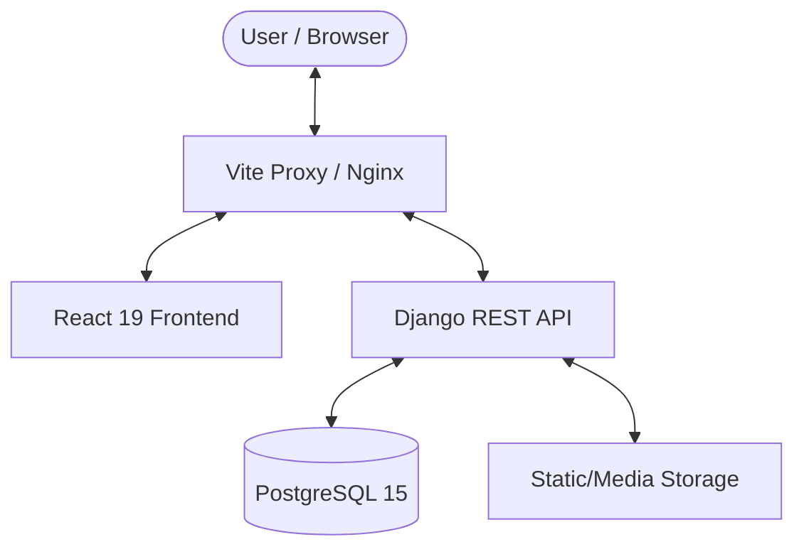

# 📄 EDCM — Electronic Document Control Management

> **Enterprise-grade document tracking, collaboration, and management system.**

EDCM is a modern, high-performance Electronic Document Control Management system designed for corporate environments. It streamlines document lifecycles through efficient tracking, real-time collaboration, and robust role-based access control.

---

## 🏛 Project Architecture



---

## 🚀 Key Features

- **🌍 World-Class Localization (i18n)**:
    - Full support for **Armenian (hy)**, **Russian (ru)**, and **English (en)**.
    - Premium language selector with flag indicators synchronized across all portals.
    - Automated cache-busting for real-time translation updates.
- **⚡ Dynamic Dashboard**: Real-time overview of document statistics, recent activity, and global search.
- **🛠 Advanced Workflow**:
    - Full CRUD operations with archiving capabilities.
    - **"Take" System**: Instant document claiming for unassigned tasks.
    - **Department Governance**: Managers oversee ownership and assignments within their departments.
- **🤝 Collaboration Suite**:
    - **Live Comments**: Threaded discussions on every document.
    - **Deep Audit Log**: Transparent tracking of every field change and ownership transfer.
    - **Multi-Format Attachments**: Support for large files (**up to 100MB**) including PDF, Word, Excel, and PowerPoint.
- **🔐 Secure RBAC**:
    - **Admin**: System-wide configuration and Django Admin access.
    - **Manager**: Departmental control and employee management.
    - **Employee**: Task focus and cross-department collaboration.
- **💎 Premium UI**: Built with Tailwind CSS v4, featuring glassmorphism, smooth transitions, and a mobile-first responsive design.

---

## 🛠 Tech Stack

| Component | Technology |
| :--- | :--- |
| **Backend** | Python 3.10+, Django 4.2+, DRF |
| **Frontend** | React 19, Vite, Tailwind CSS v4, Axios |
| **Database** | PostgreSQL 15 |
| **DevOps** | Docker, Docker Compose, Gunicorn |
| **Styling** | Modern CSS with Glassmorphism |

---

## 📖 Documentation Index

| Guide | Description |
| :--- | :--- |
| 🚀 [**QUICKSTART.md**](./QUICKSTART.md) | The fastest way to get the project running. |
| 🐳 [**DOCKER_SETUP.md**](./DOCKER_SETUP.md) | Detailed Docker and containerization guide. |
| 🌍 [**DEPLOYMENT_GUIDE.md**](./DEPLOYMENT_GUIDE.md) | Production deployment instructions (Render/VPS). |
| 🔑 [**ENV_VARIABLES.md**](./ENV_VARIABLES.md) | Full reference for configuration and secrets. |
| 🛂 [**PORTAL_SYSTEM.md**](./PORTAL_SYSTEM.md) | Details on the client-facing submission portal. |

---

## 🐳 Quick Start with Docker

The fastest way to experience EDCM is via Docker.

1.  **Environment Setup**:
    ```bash
    cp .env.example .env
    ```

2.  **Spin Up Containers**:
    ```bash
    docker-compose up --build -d
    ```

3.  **Access the System**:
    - **Frontend**: `http://localhost:5173`
    - **Backend API**: `http://localhost:8000`
    - **Django Admin**: `http://localhost:8000/admin/`

> [!TIP]
> By default, the system runs migrations and `seed_data` on first boot. Toggle this via `SEED_DATA=False` in your `.env`.

### 🔑 Default Credentials
*Available after running `seed_data`*

- **Admin**: `admin` / `adminpass`
- **Manager**: `manager` / `managerpass`
- **Employee**: `employee` / `employeepass`

---

## 🧑‍💻 Local Development

If you prefer running without containers:

### 1. Backend
```bash
python3 -m venv venv
source venv/bin/activate
pip install -r requirements.txt
python3 manage.py migrate
python3 manage.py seed_data
python3 manage.py runserver
```

### 2. Frontend
```bash
cd frontend
npm install
npm run dev
```

---

## 📁 Project Structure

```text
EDCM/
├── documents/          # Core App (Models, Views, Serializers)
├── frontend/           # React Source Code
├── config/             # Django Project Settings
├── media/              # User Uploaded Attachments
├── staticfiles/        # Collected Static Assets
└── docker-compose.yml  # Container Orchestration
```

---

## 🤝 Contributing & Support

1. **Fork** the repository.
2. Create a **Feature Branch** (`git checkout -b feature/AmazingFeature`).
3. **Commit** your changes.
4. **Push** to the branch.
5. Open a **Pull Request**.

> [!IMPORTANT]
> Always run `python3 manage.py test` before submitting changes to ensure core logic remains intact.

---

## 📄 License

This project is licensed under the MIT License - see the [LICENSE](LICENSE) file for details.

---
*Built with ❤️ by the EDCM Team*
